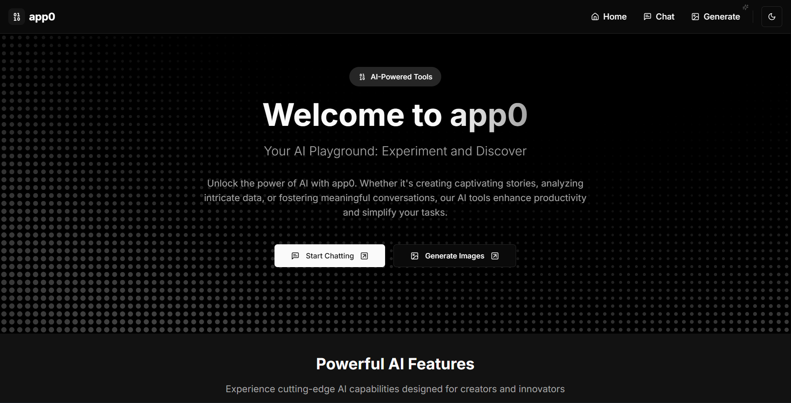

# app0

app0 is a minimalist web application for interacting with AI models through text-based chat and image generation features.

## Features

- **AI Chat Interface**: Engage with AI through a clean, text-based chat interface.
- **Image Generation**: Generate images using AI with a single click.
- **Dark Mode**: Switch between light and dark themes for a comfortable user experience.

## Screenshot



## Getting Started

Follow these instructions to set up the project locally.

### Prerequisites

Ensure you have the following installed:
- [Node.js](https://nodejs.org/) (version 14 or higher)
- [npm](https://www.npmjs.com/)

### Installation

1. Clone the repository:
   ```bash
   git clone https://github.com/cidopenup/app0.git
   cd app0
   ```

2. Install dependencies:
   ```bash
   npm install
   ```
3. Create a `.env.local` file in the root directory:
   ```bash
   touch .env.local
   ```

4. Add the following environment variable in `.env.local`:
   ```env
   REPLICATE_API_TOKEN=<API_KEY>
   ```
   Replace `<API_KEY>` with your actual Replicate API key.
### Running the Application

Start the development server:
```bash
npm run dev
```

Visit [http://localhost:3000](http://localhost:3000) to access the app.

## Usage

1. **Chat with AI**: Use the input box at the bottom of the page to type your message and press "Send."
2. **Generate Images**: Click on the "Generate Image" button to create AI-generated visuals.
3. **Toggle Dark Mode**: Use the moon icon in the header to switch themes.
